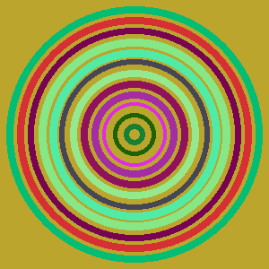

# RandomFusion Gallery: The Avalanche Effect in Action!

This gallery showcases example images generated by RandomFusion using its different procedural art styles. For each style, we demonstrate the powerful "avalanche effect": a tiny, 1-bit change in the input fingerprint results in a dramatically different visual output. This is key to RandomFusion's goal of making key differences intuitively obvious.

**Base Fingerprints Used:**
*   **Seed 1 (Original):** `MD5:11:22:33:44:55:66:77:88:99:aa:bb:cc:dd:ee:ff:00`
*   **Seed 2 (1-bit Flipped):** `MD5:11:22:33:44:55:66:77:88:99:aa:bb:cc:dd:ee:ff:01` (Note the last `00` changed to `01`)

All images are generated at 300x300 pixels unless specified otherwise by a style's default parameters.

---

## 1. Color Blocks (`--style color_blocks`)

A grid of colored blocks. Notice how the entire color scheme and arrangement change with the 1-bit flip.

**Commands:**
```bash
# Original Seed
randomfusion generate "MD5:11:22:33:44:55:66:77:88:99:aa:bb:cc:dd:ee:ff:00" --style color_blocks --width 300 --height 300 --grid-size 10 -o example_color_blocks_s1.png

# Flipped Seed
randomfusion generate "MD5:11:22:33:44:55:66:77:88:99:aa:bb:cc:dd:ee:ff:01" --style color_blocks --width 300 --height 300 --grid-size 10 -o example_color_blocks_s2.png
```

**Outputs:**

| Original Seed (`...ff:00`)           | Flipped Seed (`...ff:01`)            |
| :-----------------------------------: | :------------------------------------: |
|  |  |

---

## 2. Concentric Circles (`--style circles`)

Concentric circles where colors, count, and stroke are seed-derived. The 1-bit flip completely alters the visual characteristics.

**Commands:**
```bash
# Original Seed
randomfusion generate "MD5:11:22:33:44:55:66:77:88:99:aa:bb:cc:dd:ee:ff:00" --style circles --width 300 --height 300 -o example_circles_s1.png

# Flipped Seed
randomfusion generate "MD5:11:22:33:44:55:66:77:88:99:aa:bb:cc:dd:ee:ff:01" --style circles --width 300 --height 300 -o example_circles_s2.png
```

**Outputs:**

| Original Seed (`...ff:00`)        | Flipped Seed (`...ff:01`)         |
| :--------------------------------: | :---------------------------------: |
|  |  |

---

## 3. NoiseScape (`--style noisescape`)

Abstract Perlin noise patterns. The texture, color gradient, and overall feel are vastly different due to the minimal seed change.

**Commands:**
```bash
# Original Seed
randomfusion generate "MD5:11:22:33:44:55:66:77:88:99:aa:bb:cc:dd:ee:ff:00" --style noisescape --width 300 --height 300 -o example_noisescape_s1.png

# Flipped Seed
randomfusion generate "MD5:11:22:33:44:55:66:77:88:99:aa:bb:cc:dd:ee:ff:01" --style noisescape --width 300 --height 300 -o example_noisescape_s2.png
```

**Outputs:**

| Original Seed (`...ff:00`)           | Flipped Seed (`...ff:01`)            |
| :-----------------------------------: | :------------------------------------: |
|  |  |

---

## 4. Mandelbrot Fractal (`--style mandelbrot`)

Views of the Mandelbrot set. The 1-bit flip results in exploring a completely different region of the fractal, with different zoom, iterations, and color palettes.

**Commands:**
```bash
# Original Seed
randomfusion generate "MD5:11:22:33:44:55:66:77:88:99:aa:bb:cc:dd:ee:ff:00" --style mandelbrot --width 300 --height 300 -o example_mandelbrot_s1.png

# Flipped Seed
randomfusion generate "MD5:11:22:33:44:55:66:77:88:99:aa:bb:cc:dd:ee:ff:01" --style mandelbrot --width 300 --height 300 -o example_mandelbrot_s2.png
```

**Outputs:**

| Original Seed (`...ff:00`)              | Flipped Seed (`...ff:01`)               |
| :--------------------------------------: | :---------------------------------------: |
|  |  |

---

